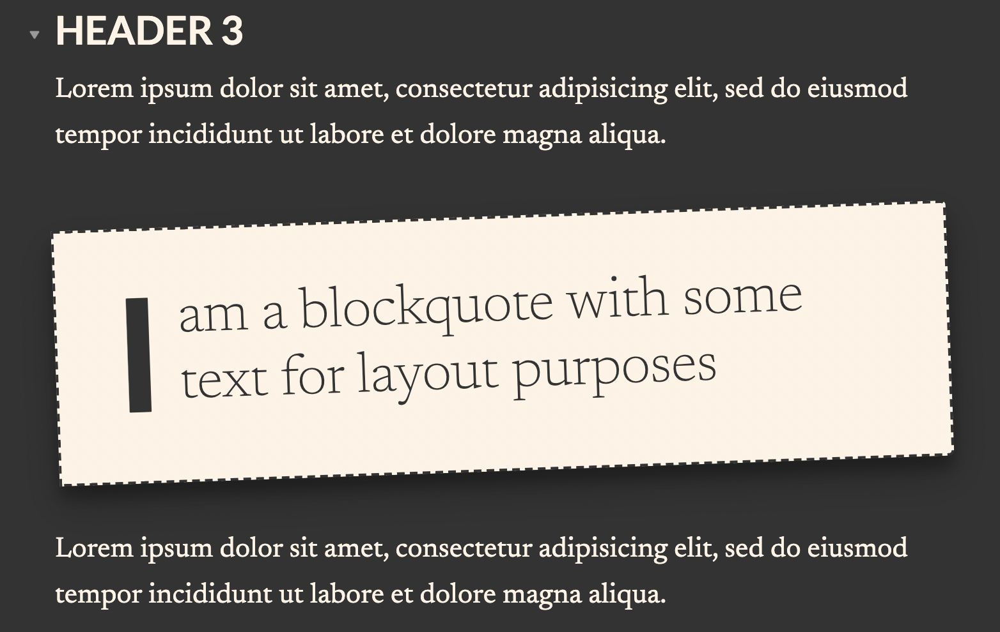
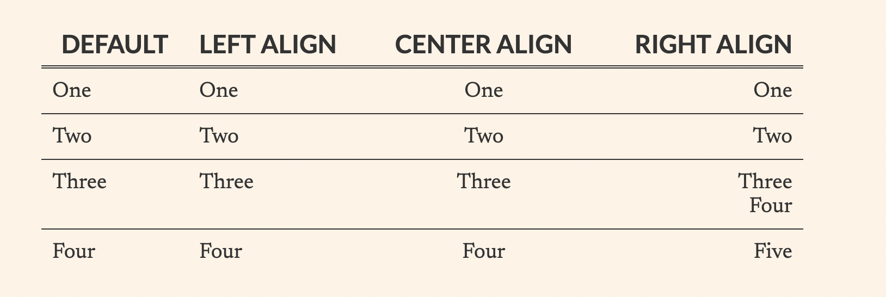

# Vintage theme for Obsidian.md

A mixture of serif and sans-serif fonts with a focus on readability and a vintage aesthetic. Features

- Dark and light mode support
- Support for editing preview mode
- Only the editing and preview window are changed. Application chrome is untouched by these styles.
- Preview mode uses serif typography
- Live preview edit mode uses monospace font and active line highlighting
- Tweaks for Dataview plugin styles
- Uses [Google fonts](https://fonts.google.com)

## Screenshots

### Light Mode

### Dark Mode

### Blockquotes

### Tables

## Fancy List Numbering

## How to Install

To install, copy the download `obsidian.css` to `.obsidian/themes` in your Vault folder and activate it under `Settings > Appearance`.
