# Vintage theme for Obsidian.md

A mixture of serif and sans-serif fonts with a focus on readability and a vintage aesthetic.

- Dark and light mode support
- Support for editing preview mode
- Preview mode uses serif typography
- Live preview edit mode uses monospace font and active line highlighting
- Plugin tweaks to match theme for Tasks and Dataview plugins
- Uses [Google fonts](https://fonts.google.com)

## Screenshots

### Light Mode

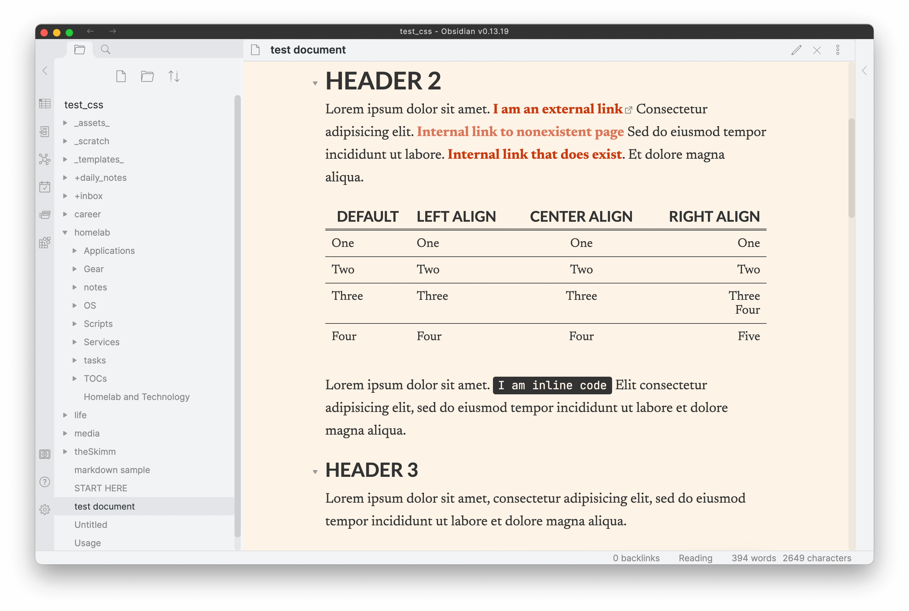

### Dark Mode

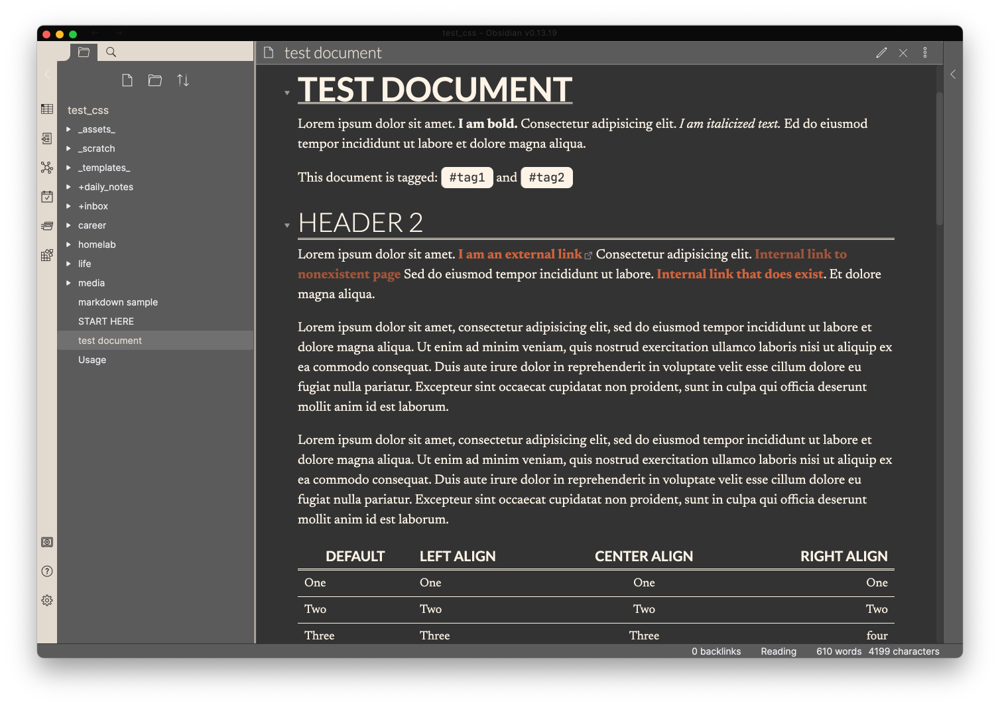

| Feature     | Light                                      | Dark                                      |
| ----------- | ------------------------------------------ | ----------------------------------------- |
| Blockquotes | 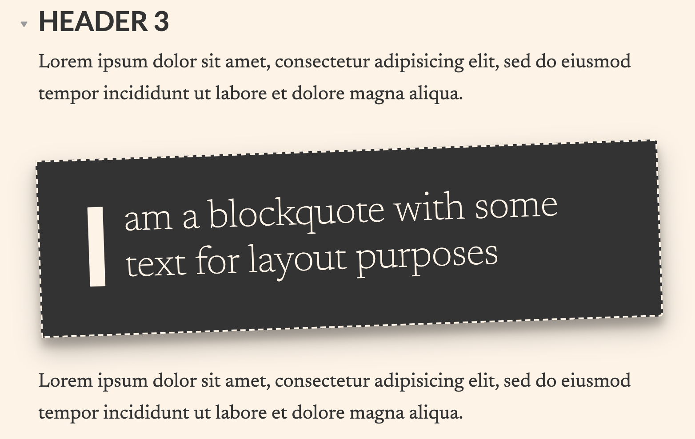 | 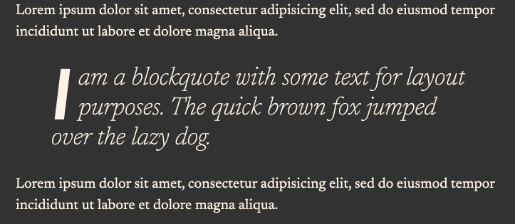 |
| Tables      | 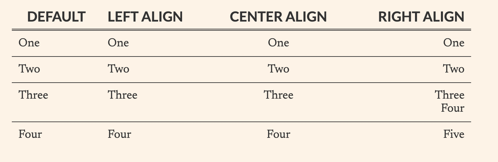          | 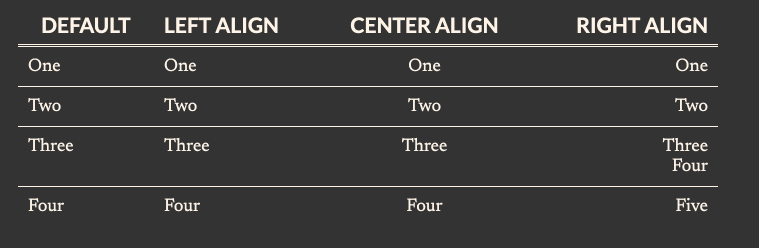          |
| Lists       |            | 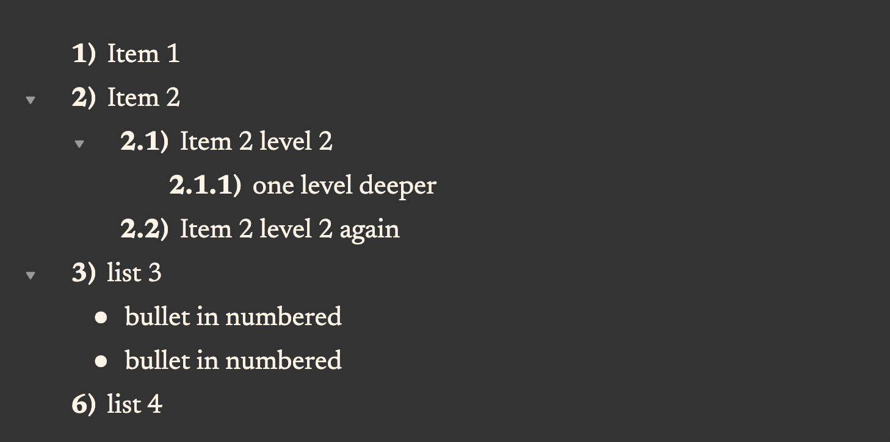           |
| Code        | 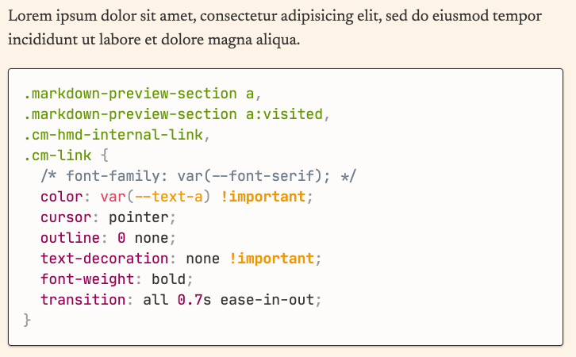             | 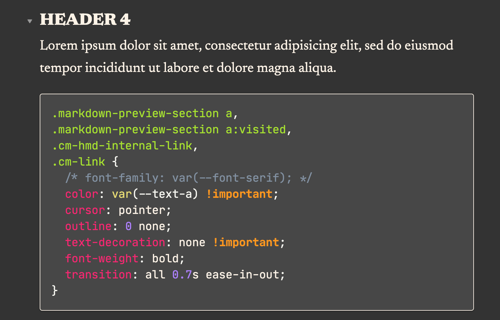             |
| Edit Mode   | 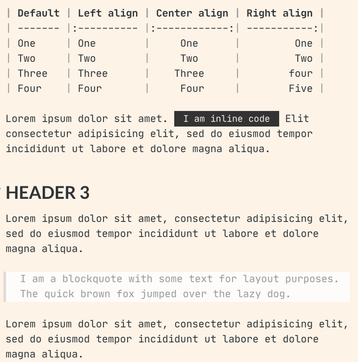    | 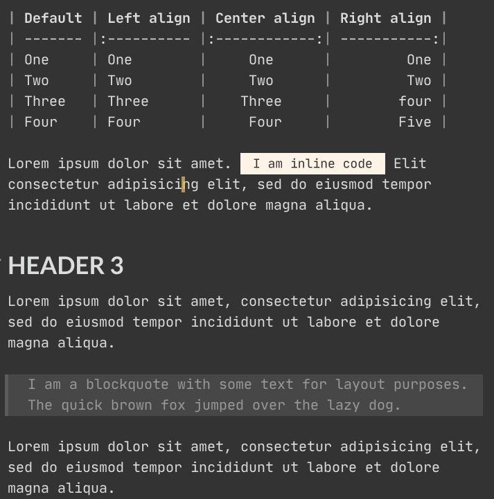    |

## How to Install

To install, copy the download `obsidian.css` to `.obsidian/themes` in your Vault folder and activate it under `Settings > Appearance`.
